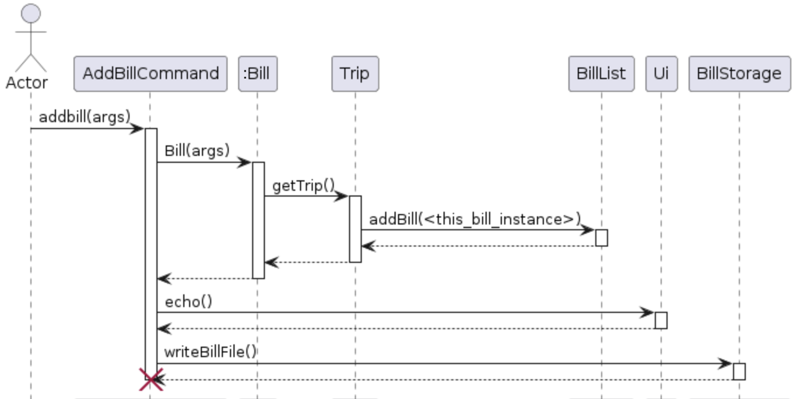

# Developer Guide - Voyagers

## Acknowledgements

This project is a team effort by the NUS CS2113 Group W14-4

## Setting Up, Getting Started

Run the JAR File, then follow the prompts through the command-line interface. Refer to this guide for syntax.

## Design & implementation

The Voyagers application is designed as a command-line interface 
(CLI) tool for managing travel trips. 
It is implemented in Java and follows a modular architecture to promote scalability and maintainability.

### Normal flow of the application

The application starts by displaying a welcome message. Then the flow is as follows:

1. The user is prompted to enter a command.
2. The application processes the command and displays the appropriate output.
3. Steps 1 and 2 are repeated until the user enters the `exit` command.

The implementation of this flow is made using four main classes: `Parser`, `Commands`, `Storage` and `Ui`.
With these classes we can encapsulate the whole logic of the application in a relative simple loop.

````java
                                    ...
  while (!isExit) {
            try {
                String fullCommand = ui.readCommand();
                Command c = NewParser.parse(fullCommand);
                c.execute(tripList, ui, null);
                isExit = c.isExit();

            } catch (Exception e) { 
                ui.echo(e.getMessage());
            }
        }
                                ...
````

The following UML sequence diagram shows the flow of the application when the user enters a command.


### Commands

As shown in the sequence diagram, commands are encapsulated in the `Command` class.
This class is abstract and each command is implemented in a subclass of `Command`.

The `Command` class has the following structure:

````java
public abstract class Command {
    protected boolean isExit = false;
    public abstract void execute(TripList tripList, Ui ui, Storage storage) throws VoyagersException;
    public boolean isExit() {
        return isExit;
    }
}
````

The main logic of each command is implemented in the `execute` method. 

### Parser

To parser the user input into a command we have implemented a `Parser` class. 
This parser is quite generic and easy to extend to include new commands.

The parser works with another class called 'ParserDefinition'. This class is a simple data structure that contains the
expected arguments for each command.

### Simplifying bills: minimizing number of transactions.

Each trip can have multiple bills associated. We have decided to include a functionality to simplify the bills
from a trip. This means that we will try to minimize the number of transactions between the participants of the trip.

The implementation uses a graph algorithm to find the minimum number of transactions between the participants of the trip.
The code has been adapted to the one found in the following [link](https://medium.com/@mithunmk93/algorithm-behind-splitwises-debt-simplification-feature-8ac485e97688).

The next diagram shows the flow of the application after the user enters the `simplifybills` command.


## Bill
Bill implements Payable, an interface to be used a few times in this project to cover 
actions involving payment. It is dependent on the Profile and Trip classes, and Parser
is dependent on the Bill class. The commands currently supported are `addbill`, `paybill`, `listbills`, and 
`setbillcurrency`. 

The following UML diagram shows the flow of the application after the user enters the `addbill` command
with the correct arguments.



## Review
The Review class, instantiated solely by the Trip object. 
It enables users to assign trip ratings (1-10) in Review's 'int score' attribute and input personal reflections and 
encapsulates individual sentiments in Review's 'String reflection attribute, facilitating comprehensive user feedback.
Currently, Reviews are not stored when the app exits, this implementation is planned.

## Status
When a trip is cancelled, the status of the trip is changed to 'cancelled'. Otherwise, the trip will be 'completed', 
'ongoing' or 'upcoming'. Depending on the starting and ending time of the trip.

## Product scope
### Target user profile

Individuals who frequently embark on journeys and require a reliable method to document their itinerary, 
capture memories through photos, and track expenses effectively.

### Value proposition

The ultimate travel companion designed for adventurers who crave seamless organisation and unforgettable experiences. 
With our intuitive digital diary, users can effortlessly manage their itinerary, capture precious memories with 
integrated photo features, and track expenses for a worry-free journey. Users can enjoy anytime, anywhere access across 
their local devices. We also have customisation options tailored to users’ unique style.


## User Stories

| As a ... | I want to ...                        | So that I can ...                                    |
|----------|--------------------------------------|------------------------------------------------------|
| new user | add a new trip                       | plan my upcoming travel itinerary                    |
|user | modify, delete, list, and find trips | edit and view my current itinerary |
| user | add subtrips                         | manage days and other trips within my main trip |
| user     | review my trips                      | give scores or simple comments on my completed trips |
| user     | add, list, and pay bills             | easily keep track of expenses across trips           |


## Non-Functional Requirements

1. Should work on any mainstream OS as long as it has Java 11 or above installed.
2. A user with good typing speed for English text, conducive to this command-line interface based app.
3. A user doesn't need to be very tech-savvy, but should still understand how to use flags as described by
our UG.
4. The system should have a good performance, responding in less than a few seconds.
5. Source code is open source.
6. The product is available as a free service.


## Glossary

trip - class which represents an event, contains information regarding trip such as name, start, end, location, description, status, review
main trip - trip which is not a sub trip contained in the TripList of another trip
sub trip - trip which is contained in the TripList of another trip
status - enum type of trip, (ONGOING, UPCOMING, CANCELLED, COMPLETED)
review - class which represents user's feelings about a completed trip, contains a score of 1-10 and an open-ended reflection
bill - class which represents a transaction, contains information such as trip name, bill name, payer, others (people paid for by payer), total amount, percentage splits to payer/others

## Instructions for manual testing

### Launch and shutdown

1. Initial launch
    1. Download the jar file and copy into an empty folder
    2. Open a CLT app and navigate to the folder containing the jar file
    3. Execute the jar file by entering into the CLT: `java -jar .\tp.jar`
       The jar file will run, the welcome message should be printed, along with the current list of trips.
2. Test commands
    1. Instructions for testing commands can be found in [command tests](#command-tests).
3. Shutdown
    1. Exit the program by inputting the below command:

       ```bash
       exit
       ```

## Command Tests

### List trips

1. List can be run with or without a specified status to print trips
    1. Test case: `list`

       Expected: A list of all trips is printed

    2. Test case: `list x` (where x is a valid trip status)

       Expected: A list of only trips of that status is printed.
    3. Test case: `list y` (where y is not a valid trip status)
       Expected: A warning message stating invalid list type is printed.

### Add a main trip

1. Command to add a main trip with a name, start date, end date, location, and description. All details are required and
   the order of input flags is fixed. Case-sensitive.
2. The command format
   is `addmaintrip /n <trip name> /start <yyyy-MM-dd> /end <yyyy-MM-dd> /location <location> /d <description>`
    1. Test case: `addmaintrip /n new unique name /start 2024-01-01 /end 2024-01-01 /location Home /d New Year`

       Expected: Trip is added successfully.
    2. Test case: `addmaintrip /n repeated name /start 2024-01-01 /end 2024-01-01 /location Home /d New Year`

       Expected: Message printed warning trip name already exists.
    3. Test case: `addmaintrip /n new unique name /start 2024-01-01 /end 2024-01-01 /d New Year` (missing flag)

       Expected: Message printed warning missing arguments.
    4. Test case: `addmaintrip /n new unique name /STARTH 2024-01-01 /end 2024-01-01 /location Home /d New Year`(
       invalid/misspelled flag)

       Expected: Message warning invalid argument
    5. Test case: `addmaintrip /location Home /n unique name /STARTH 2024-01-01 /end 2024-01-01 /d New Year`(out of
       order arguments)

       Expected: Message warning the first out of order argument is invalid
    6. Test case: start date after end date

       Expected:

### Delete a main trip

1. Delete an existing main trip with reference to its unique name
    1. Prerequisites: List the main trips using the `list` command or with `list <status>`to know the name of the trip
       to be deleted.
    2. Test case: `deletemaintrip /n <valid name>`

       Expected: Main trip (and all its sub trips) is deleted.
    3. Test case: `deletemaintrip /n <invalid name>`

       Expected: Message saying no such trip found
    4. Test case: `deletemaintrip <valid name>` (missing flag `/n`)

       Expected: Message saying missing arguments.

### Adding a subtrip

1. Add a sub trip onto an existing main trip with reference to the main trip's unique name. All details are required and
   the order of input flags is fixed. Case-sensitive.
2. The format is
   addsubtrip `addsubtrip /n <valid main trip name> /start <yyyy-MM-dd> /end <yyyy-MM-dd> /location <location /d <description>`
    2. Prerequisites: List the main trips using the `list` command or with `list <status>` to know the name of the main
       trip to add a sub trip to
    2. Test
       case: `addsubtrip /n <valid main trip name> /start <yyyy-MM-dd> /end <yyyy-MM-dd> /location <location /d <description>`

       Expected: Sub trip is added successfully. Sub trip is printed listed when the main trip is printed
    3. Test
       case: `addsubtrip /n <invalid main trip name> /start <yyyy-MM-dd> /end <yyyy-MM-dd> /location <location /d <description>`

       Expected: Message saying no such main trip found.
    4. Test case: sub trip start is earlier than main trip start OR sub trip end is later than main trip end

       Expected: Message warning sub trip is not within the main trip's date range.
    5. Test case: sub trip start is after the main trip's end

       Expected: Message warning the sub trip's start is after the main trip's end.

### Modifying a trip

1. Change a detail of an existing main trip. Command required corresponds to detail to be changed.
   1. Prerequisites: use `list` to find the names of existing main trips and sub trips.
   2. Name - `setname <current trip name> /n <new name>`
      1. Test case: `setname <valid exiting trip name> /n <new unused name>`
         
         Expected: Trip name is changed successfully, its sub trips' names are also changed
      2. Test case: `setname <valid exiting trip name> /n <already used name>`

         Expected: Message warning a trip with that name already exists.
      3. Test case: `setname MainTripName-1 /n <already used name>` (`-1` suffix to trip name signifies a sub trip name)

         Expected: Message warning you cannot change sub trip name.
   3. Dates - `setdates <current trip name> /start <yyyy-MM-dd> /end <yyyy-MM-dd>`
      1. Test case: new start earlier than new end
      
         Expected: Trip's dates changed successfully.
      2. Test case: new start later than new end

         Expected: Message warning start date cannot be after end date.
   4. Location - `setlocation <current trip name> /location <new location>`
      1. Location is open-ended, if command is used with a valid trip name and flag `/location`, setlocation will succeed
   5. Description - `setdescription <current trip name>< /d <new description>`
      1. Description is open-ended, if command is used with a valid trip name and flag `/d`, setdescription will succeed

### Cancelling / Uncancelling a main trip
1. Cancelling/uncancel a main trip without removing its record
2. Command format `setstatus <main trip name> /status <cancel or uncancel>`
   1. Test case: `setstatus <main trip name> /status cancel` (cancelling an upcoming trip)

      Expected: Trip status is changed from UPCOMING to CANCELLED

   2. Test case: `setstatus <main trip name> /status uncancel` (uncancelling a cancelled trip)

      Expected: Trip status is changed from CANCELLED to UPCOMING

   3. Test case: `setstatus <completed main trip name> /status cancel` (uncancelling a cancelled trip)

      Expected: Message warning trip is already completed
### Reviewing a main trip

1. Review a completed main trip by giving it a 1-10 score and an open-ended reflection.
   1. Prerequisites: use `list completed` to find the names of completed main trips.
   2. Command format `review <main trip name> /s <1-10> /r <reflection>`
      1. Test case: `review <valid completed main trip name> /s 10 /r it was great`

         Expected: Review will be added successfully.
      2. Test case: `review <invalid trip name> /s 5 /r it was so and so`

         Expected: Message warning no such trip found
      3. Test case `review <valid non-completed main trip name> /s 1 /r I haven't even done this yet`

         Expected: Message warning trip must be completed before it can be reviewed
      4. Test case: `review <subtrip name> /s 1 /r lorem ipsum` (eg. sub trip name of 'China' could be China-1)

         Expected: Message warning no such trip found

### Reading reviews

1. Read review to see what review you previously gave a completed main trip
   1. Prerequisites: review a completed main trip
   2. Command format `readreview <main trip name>`
      1. Test case: `readreview <reviewed main trip>`

         Expected: Review printed to screen
      2. Test case: `readreview <unreviewed main trip`

         Expected: Message warning no review exists for this trip
      
### Adding a bill

1. Add a bill with details of trip, name, payer, others, amount, percentages
2. Command format `addbill /trip <main trip name> /n <bill name> /payer <Payer> /others <OtherName1 ...> /amount <amount> /percentages <percetagePayer percentageOtherName1 ...`
   1. Test case: Number of (buyer + others) = number of percentages AND percentages sum to 100

      Expected: Bill successfully created
   2. Test case: Percentages do not sum to 100

      Expected: Message warning percentages do not sum to 100
   3. Test case: Any name is repeated among Payer and Others

      Expected: Message warning repeated names in payer and others
   4. Test case: Invalid trip name

      Expected: No such trip found

### Paying a bill

1. Mark a bill as paid
2. Command format `paybill /trip <main trip name> /n <billname>`
   1. Test case: valid main trip name with valid bill name

      Expected: Bill is marked as paid
   2. Test case: invalid trip name - bill name pair
    
      Expected: Message warning no such bill found
### List bills
1. List all bills
2. Command format `listbills`
   1. Test case: `listbills`

      Expected: all bills are printed