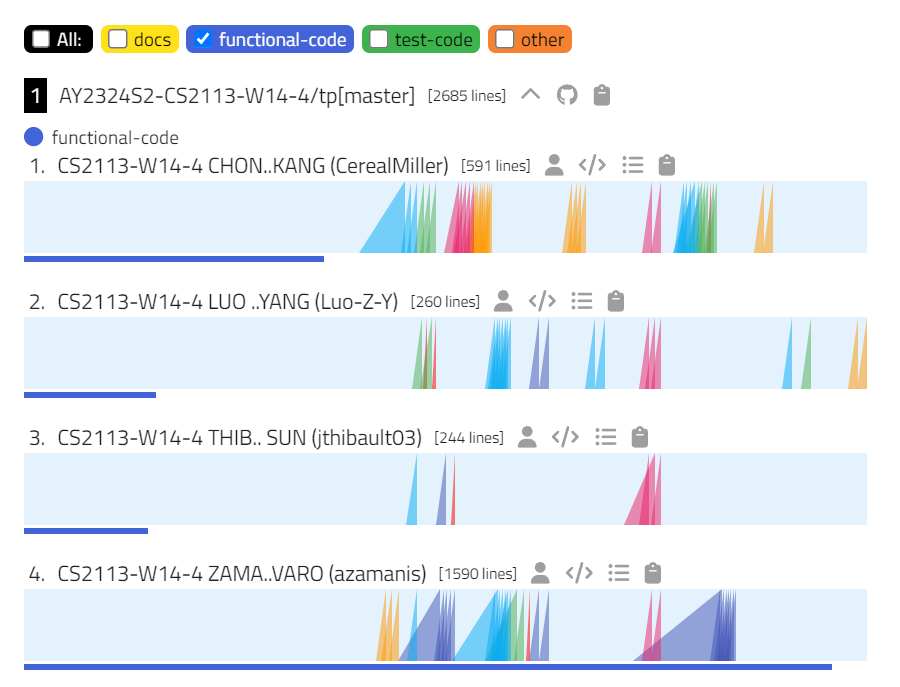

# Overview

This document provides a summary of my contributions to the project. The project consists on developing an application called `Voyagers` to manage trips.

First of all, I would say that my most important contribution to the project has been in terms on managing. 
Our team was only 4 people and two of us were exchangers. Although, it's usually assumed that the exchangers will not
get involve in the projects, it was definitely not my case. I assumed the leader role since one of the first sessions, not because I wanted, but because no one was trying to lead the project and there was a lack of initiative.
During the whole project I tried to divide and assign tasks, as well as trying to bring up conversations on what we wanted to achieve and implement.

On the code side, I have developed several classes but most importantly, I have worked in the integration of the code. Because we lacked some communication, the code developed by every member sometimes did not fit with the rest of the code. 

# Summary of Contributions

# Code contributed: 

The link for my contribution can be found [here](https://nus-cs2113-ay2324s2.github.io/tp-dashboard/?search=azamanis&breakdown=true&sort=groupTitle%20dsc&sortWithin=title&since=2024-02-23&timeframe=commit&mergegroup=&groupSelect=groupByRepos&checkedFileTypes=docs~functional-code~test-code~others).

I focused mainly in the development of the following classes:

- Trip
- Command: abstract class and its subclasses
- Parser
- BillSettler
- TripList
- Ui

# Enhancements implemented: A summary of the enhancements you implemented.

## Improving the parser: 
The parser was not originally assigned to me. However, the old parser was not very generalized and it 
needed to write a new function for each new command. I changed the parser to be more general and to save time for the future.

## Simplifying bills:
This is one of the most distinctive features of the app, as the rest are basically CRUD operations for the different classes.
This was mainly a task of reading information articles as the idea was not coming up with an algorithm from scratch.
After documenting myself, I found a [website](https://medium.com/@mithunmk93/algorithm-behind-splitwises-debt-simplification-feature-8ac485e97688) were the problem was explained and a template code was provided.

After the documenting process, the task was to adapt the code to our project.

# Contributions to the UG: Which sections did you contribute to the UG?

For the user guide, I have focused in the sections related with the classed I developed.

# Contributions to the DG: Which sections did you contribute to the DG? Which UML diagrams did you add/updated?

The main contributions can be found in the Design and Implementation section.
- Normal flow of the application.
- Commands
- Parser
- Symplifying bills

The following (all the) sequence diagrams in the DG were created by me.

- Sequence Diagram for the flow of the application

- Sequence Diagram for the simplification of bills.

Furthermore, I contributed to other minimal sections of the DG such as the index and organizing the different sections.

### Community:
- **Community 1**: Reported bugs and suggestions for other teams in the project, both during labs and the PE dry run test.
- **Community 2**: 